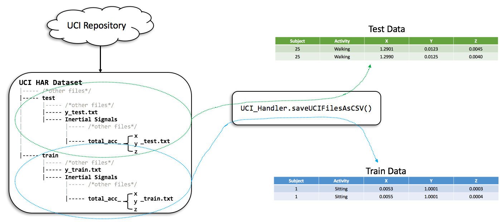
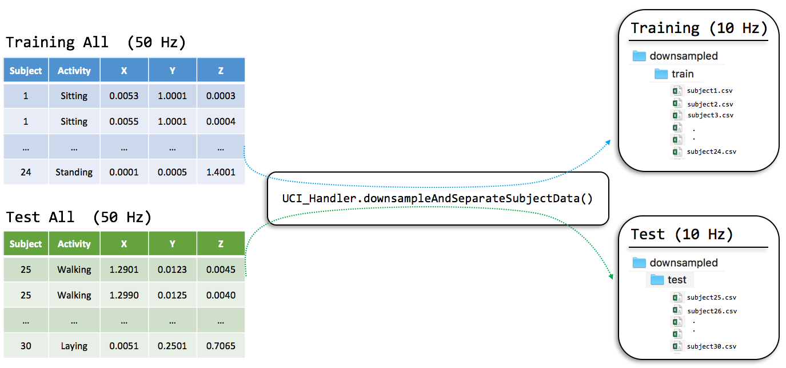

# Data Cleaning

```
Author: Matin Kheirkhahan
        matinkheirkhahan@ufl.edu
```

This package provides the following functionalities:

* Converting human activity recognition dataset from UCI repository into `.csv` files.
* Downsampling to 10 Hz and dividing UCI data into separate files for each subject.


## Converting UCI Human Activity Recognition Dataset to `csv` Files

UCI repository offers a dataset for human activity recogntion (HAR) containing **accelerometer** and gyroscope data collected from 30 volunteers who performed 6 types of activity. The data is collected using smartphones with 50 Hz sampling rate. More details are available [here](https://archive.ics.uci.edu/ml/machine-learning-databases/00240/).

The raw data are provided in 128 sensor readings per row, which requires further processing to obtain a nice tabular format. _Unless you are interested in calculating features for every row (2.56 second of data)_.

The implemented function `UCI_Handler.saveUCIFilesAsCSV()` reads UCI files (as-is), removes duplicate data (they have 50% overlap), and generates two `csv` files; one for training data and one for test. The figure below shows the process:



The following code snippet shows how to run the code to get two `csv` files:

```python
# UCI_Handler class contains all the functions required to preprocess UCI files for analysis.
from data_cleaning.uci_handler import UCI_Handler

if __name__ == "__main__":
    uh = UCI_Handler()

    # Function requires three arguments:
    # 1. The folder where you have extracted UCI HAR Dataset files.
    # 2. Which folder (either "train" or "test") to look into for conversion.
    # 3. Which sensor file to read.
    #    i. "total_acc"
    #   ii. "body_acc"
    #  iii. "body_gyro"
    
    # Write training data as csv
    dataset_type = "train"
    type_sensor = "body_acc"
    data_folder = r"/Users/matin/Desktop/UCI HAR Dataset/{}/".format(dataset_type)

    # Saves data into "Users/matin/Desktop/UCI HAR Dataset/train/train_body_acc_data.csv"
    uh.saveUCIFilesAsCSV(data_folder, dataset_type, type_sensor)

    # Write test data as csv
    dataset_type = "test"
    type_sensor = "body_acc"
    data_folder = r"/Users/matin/Desktop/UCI HAR Dataset/{}/".format(dataset_type)
    
    # Saves data into "Users/matin/Desktop/UCI HAR Dataset/test/test_body_acc_data.csv"
    uh.saveUCIFilesAsCSV(data_folder, dataset_type, type_sensor)
```


## Downsampling & Dividing UCI Data into Separate Files

Since human movement frequencies are within [0.6 and 2.5] Hz range, we can downsample the data to 10 Hz to reduce the data size and get rid of unwanted information. Moreover, since in our proposed model we are learning recurring patterns for each subject, we should save each subject data separately for faster processing. The implemented function `UCI_Handler.downsampleAndSeparateSubjectData()` does both!

* Downsample data to 10 Hz by reducing every 5 data points to 1 point by taking their average value.
* Saving separate `.csv` files for each subject.



Here is how to call use this function:

```python
from data_cleaning.uci_handler import UCI_Handler

if __name__ == "__main__":
    uh = UCI_Handler()

    # ------- Training --------
    # Where to find csv file generated by `uh.saveUCIFilesAsCSV` function.
    data_folder = r"/Users/matin/Desktop/UCI HAR Dataset/train/"
    # csv filename
    data_filename = r"train_body_acc_data.csv"
    # Where to save the new 10Hz data files (separated for each subject)
    out_folder = r"/Users/matin/Desktop/UCI HAR Dataset/downsampled/train/"

    uh.downsampleAndSeparateSubjectData(data_folder, data_filename, out_folder)


    # ------- Test --------
    # Where to find csv file generated by `uh.saveUCIFilesAsCSV` function.
    data_folder = r"/Users/matin/Desktop/UCI HAR Dataset/test/"
    # csv filename
    data_filename = r"test_body_acc_data.csv"
    # Where to save the new 10Hz data files (separated for each subject)
    out_folder = r"/Users/matin/Desktop/UCI HAR Dataset/downsampled/test/"

    uh.downsampleAndSeparateSubjectData(data_folder, data_filename, out_folder)
```

