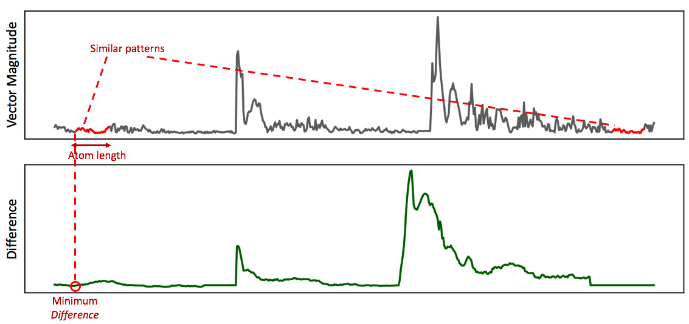
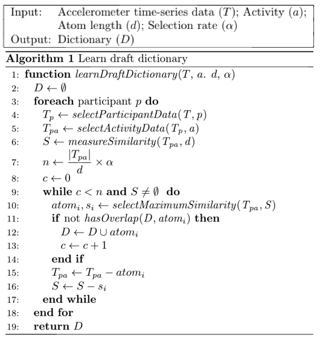
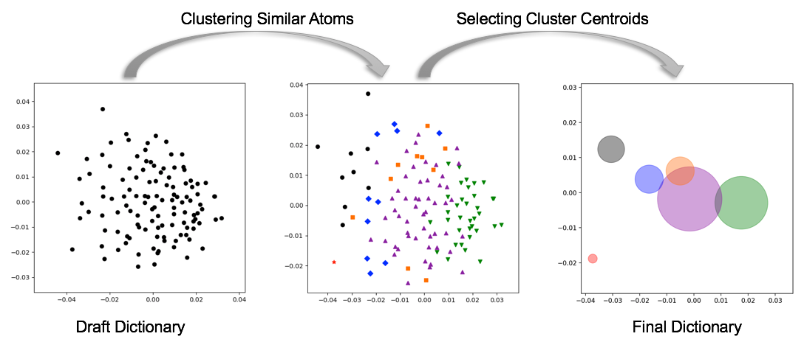
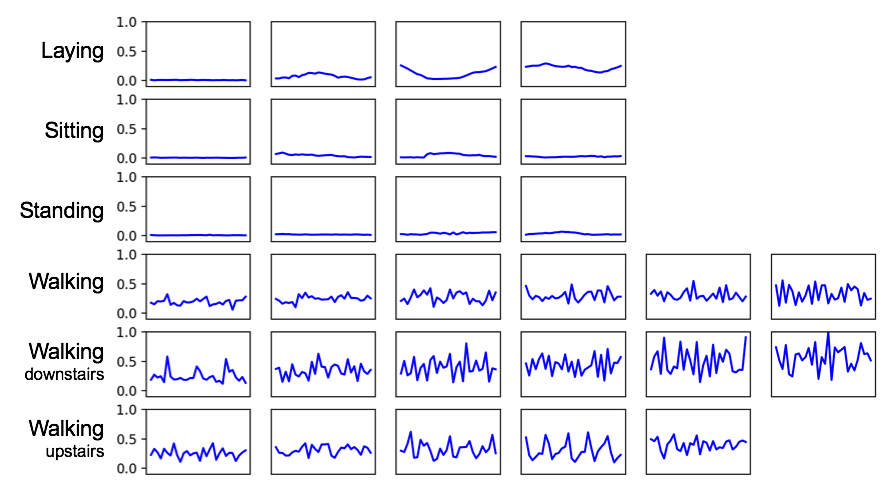

#Dictionary Learning

```
Author: Matin Kheirkhahan
        matinkheirkhahan@ufl.edu
```

This package provides the following functionalities:

1. Learning **dictionary draft** (initial _atom_ pool).
   * Learning patterns of activity which _seem_ to be repeating in the data.
2. Learning **final dictionary**.
   * Excluding redundant _atoms_ from selected activity patterns and generating the final dictionary.


This is the first step to find repeatitive patterns in a specific type of activity. To this end, for each participant and activity, repeatitive patterns are found by:

* Defining a sliding window _w_ and comparing its similarity with next windows.
  * If there is _n_ points in the data, for a window _w_, we will have _n_ - |_w_| - 1 windows to compare.
* For each window _w_, we keep the most similar window and their differences.
* We keep _non-redundant_ window with minimum _difference_ and keep them in the initial pool (**dictionary draft**).
* Since this step is done for each patient and activity separately, we try to find groups of similar acceleration patterns (_atoms_) once again in the end to find the **final dictionary** containing unique _atoms_.


## Learning Dictionary _Draft_ (_Supervised_)

This part, learns recurring patterns of accelerometer data for one specified activity.

The core idea of finding repeatitive patterns is to check similarity of a selected time window with next ones. For each time window _w_, we calculate its difference with next windows. The window with minimum difference with _w_, and is used as an indicator of how likely is to expect the accelerometer pattern in the future. Figure below shows the process.



Now, that we realized how _similarity_ (or _difference_) is measured for each time window, let's use it to learn the **dictionary draft**. The overall algorithm to learn the initial pool of _atoms_ (i.e., recurring accelerometer patterns for an activity), which we call dictionary draft, is shown below.



We select _atoms_ based on their _similarity_ measures. We start with the _atom_ with maximum similarity and add it to our pool. The next _atom_ has 

1. highest similarity
2. no overlap with previously selected _atoms_ (to achieve minimum redundancy)

```python
from dictionary_learning.supervised_learner import SupervisedLearner
from dictionary_learning.utils import Utils
import os
import pandas as pd

def learnDictionaryDraft(activity: str, atom_len: int, training_folder: str, out_folder:str):
    """
    :param activity: one of the following choices -> ['STANDING', 'SITTING', 'LAYING', 'WALKING', 'WALKING_DOWNSTAIRS', 'WALKING_UPSTAIRS']
    :param training_folder: absolute address to where the processed training files (vector form) are located.
    :param out_folder: absolute address to where the draft dictionary files are saved.
    """
    # Instantiating supervised learner class.
    sl = SupervisedLearner()

    # Preparing draft dictionary DataFrame
    draft_dictionary_df = None

    # Reading training files and selecting _candidate_ atoms
    filenames = os.listdir(training_folder)
    for filename in filenames:
        print("\n\n---------- {} ----------".format(filename))
        ppt_df = pd.read_csv("{}{}".format(training_folder, filename))
        activity_df = ppt_df.loc[ppt_df.activity == activity, :]
        
        # Learning draft dictionary has the following input arguments:
        # 1. activity_df: a DataFrame (m x 6); where m is the number of data points and columns are
        #                         - subject
        #                         - activity
        #                         - X, Y, Z, VM
        # 2. draft_dictionary_df: previously found _candidate_ atoms that we append the new _candidates_ to this DataFrame.
        # 3. atom_length: atom durations (in seconds)
        # 4. prc: determines the percentile to keep. (top acceleration patterns with minimum dissimilarity with future patterns)
        # 5. dist_func: a distance function which gets two vectors and returns a distance. (see Utils class for the implemented distance functions)
        # 6. samplingRate: number of data points in a second.
        dictionary_df = sl.learnAndAppendDraftDictionary(activity_df,
                                                         draft_dictionary_df,
                                                         atom_length=atom_len,
                                                         prc=20,
                                                         dist_func=Utils.dtw,
                                                         samplingRate=10)


	# Saving the draft dictionary for the specified activity.        
    draft_dictionary_df.to_csv("{}supervised_{}_draft_dictionary.csv".format(out_folder, activity), index=False)
    
if __name__ == "__main__":
    activity = "LAYING"
    atomLenSec = 3
    training_folder = r"/Users/matin/Desktop/UCI HAR Dataset/training_10Hz/"
    out_folder = r"/Users/matin/Desktop/UCI HAR Dataset/training/draft_dictionaries/"
    learnDictionaryDraft(activity, atomLenSec, training_folder, out_folder)
```

The learned **dictionary draft** requires one additional pass to remove identical or similar _atoms_ and generate the **final dictionary** for an activity.


## Learning _Final_ Dictionary

To learn the _final_ dictionary for each activity, we try to select atoms with minimum overlapping information. To this end, we apply clustering with similar distance metric used in _measureSimilarity_ function.

The figure below shows an atom presentation (approximation) in 2D. The distances between atoms show their differences. At the first step, similar atoms are assigned to one cluster. Next, from each cluster, the centroid (the closest atom to the center) is selected for the final dictionary. We would like to use _actual_ accelerometer patterns observed in our data and that is the reason behind selecting the cluster centroid for final dictionary, instead of adding an aritificial _mean_ atom to represent its cluster.



To find the best number of clusters, we use hierarchical clustering with complete linkage to obtain spherical segments of similar atoms. We also use the same distance function as used to learn the draft dictionary, to be able to find analogous atoms in the same way.

###Generate the plots

The function `atomVisualization_2DScatterPoints()` is developed for generate (an _approximate_) scatter plots of atoms in 2D. If `cluster_numbers` are provided, it will produce a scatter plot in color. Here is an example:

```python
from dictionary_learning.supervised_learner import SupervisedLearner
from dictionary_learning.utils import Utils
import pandas as pd

draft_dictionary_filename = r"Users/matin/Desktop/UCI HAR dataset/training/draft/supervised_laying_draft_dictionary.csv"

sl = SupervisedLearner() # Instatiating the class
draft_dictionary_df = pd.read_csv(draft_dictionary_filename) # Reading draft dictionary
draft_dictionary_df = sl.reshapeToTabular(draft_dictionary_df) # Reshaping data to tabular

# ----- No color | Just atoms plot -----
sl.atomVisualization_2DScatterPoints(draft_dictionary_df, Utils.dtw, cluster_numbers=None, just_centers=False)

# ----- With cluster numbers | color points -----
clst_df = sl.applyClustering(draft_dictionary_df, cutoff=0.020, Utils.dtw)
sl.atomVisualization_2DScatterPoints(draft_dictionary_df, Utils.dtw, cluster_numbers=clst_df.cluster_number.values, just_centers=False)

# ------ Just cluster centers | colored circles ------
sl.atomVisualization_2DScatterPoints(draft_dictionary_df, Utils.dtw, cluster_numbers=clst_df.cluster_number.values, just_centers=True)
```


### Saving final dictionary

The function `learnFinalDictionary()` receives the dictionary draft and calculates distances between atoms using the given distance function (e.g., `Utils.dtw`). Then by applying the given `cutoff`, it forms clusters, picks the centroid, and returns a `pandas.DataFrame` with the centroids as the final dictionary atoms.

```python
from dictionary_learning.supervised_learner import SupervisedLearner
from dictionary_learning.utils import Utils
import pandas as pd

draft_dictionary_filename = r"Users/matin/Desktop/UCI HAR dataset/training/draft/supervised_laying_draft_dictionary.csv"

dictionary_filename = r"Users/matin/Desktop/UCI HAR dataset/training/draft/supervised_laying_final_dictionary.csv"

sl = SupervisedLearner() # Instatiating the class
draft_dictionary_df = pd.read_csv(draft_dictionary_filename) # Reading draft dictionary
draft_dictionary_df = sl.reshapeToTabular(draft_dictionary_df) # Reshaping data to tabular

# Learning the final dictionary from candidate atoms (dictionary draft)
final_dictionary_df = sl.learnFinalDictionary(draft_dictionary_df, cutoff=0.020, dist_func=Utils.dtw)

# Save the learned dictionary
final_dictionary_df.to_csv(dictionary_filename, index=False)
```


### Visualizing the learned dictionary waveforms

Although the idea is that we learn a dictionary for a specific activity, you can visualize all of the atom waveforms learned for all the activities using `SupervisedLearner.visualizeDictionaryWaveforms()` function. The example below shows a learned dictionary from [UCI HAR dataset](https://archive.ics.uci.edu/ml/machine-learning-databases/00240/).



To produce a plot like the one shown above,

1. First, we should merge all atoms into one single `pandas.DataFrame`.
2. Each row should have a column `activity` which has the activity label.
3. Pass the `DataFrame` to the function for visualization.

```python
from dictionary_learning.supervised_learner import SupervisedLearner
import pandas as pd

sl = SupervisedLearner()
activities = ['laying', 'sitting', 'standing', 'walking', 'walkingdown', 'walkingup']
dictionary_df = None # dataset to hold all atoms from every activity

# Going over all the files in the folder and append all atoms to one DataFrame
for activity in activities:
    df = pd.read_csv(r'/Users/matin/Desktop/UCI HAR Dataset/final_dictionaries/supervised_{}_final_dictionary.csv'.format(activity))
    df["activity"] = activity
    if dictionary_df is None:
        dictionary_df = df
    else:
        dictionary_df = dictionary_df.append(df, ignore_index=True)

plot_save_address = r"/Users/matin/Desktop/dictionary.pdf" # where to save the plot
sl.visualizeDictionaryWaveforms(dictionary_df, plot_save_address)
```

